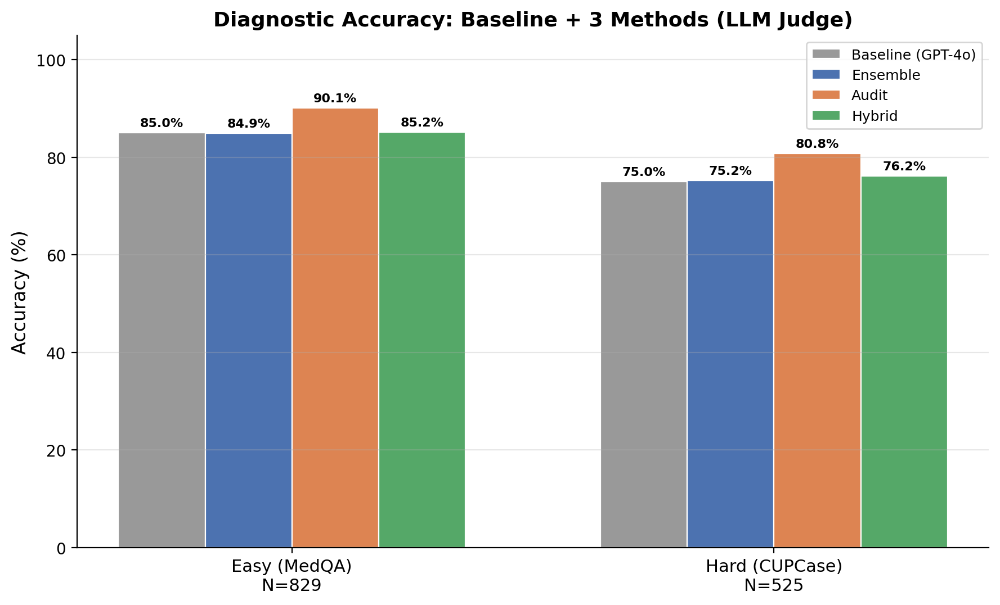
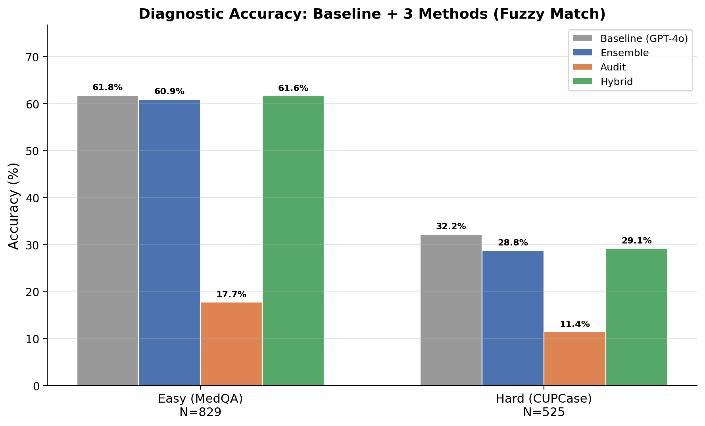

# CUPCase Diagnostic Pipeline

This repository evaluates LLM-based diagnostic methods on two clinical datasets:

- **Easy (MedQA):** Standard medical Q&A cases (`datasets/easy_medqa.csv`, 4,177 cases)
- **Hard (CUPCase):** Real-world uncommon patient cases (`datasets/Case_report_w_images_dis_VF.csv`, 110K+ rows)

## Methods

### Baseline: GPT-4o Standalone
Single-model zero-shot diagnosis using GPT-4o (extracted from Stage 1 output).

### Stage 1: Knowledge Ensemble (`ensemble_v2.py`)
Aggregates independent candidate diagnoses from **GPT-4o** and **DeepSeek-V3**, then checks semantic agreement.

### Stage 2: Systematic Reasoning Audit (`audit_pipeline.py`)
Forces a structured "For vs. Against" evidence check for each candidate using **GPT-4o**, producing a final diagnosis with confidence score.

### Stage 3: Hybrid Pipeline (`hybrid_boss_turbo.py`)
Combines Stage 1 (ensemble) and Stage 2 (audit) sequentially: candidates from the ensemble are passed through the audit filter.

## Setup

1. Copy `.env.example` to `.env` and add your API keys:
   ```bash
   cp .env.example .env
   ```
2. Install dependencies:
   ```bash
   pip install openai pandas tqdm nest_asyncio python-dotenv
   ```

## Full Benchmark Results (N=1,354)

Results on the full datasets: Easy (MedQA, N=829) and Hard (CUPCase, N=525).

### LLM Judge (DeepSeek clinical equivalence)

| Method | Easy (MedQA) | Hard (CUPCase) |
|--------|:------------:|:--------------:|
| Baseline (GPT-4o) | 85.0% | 75.0% |
| Ensemble | 84.9% | 75.2% |
| **Audit** | **90.1%** | **80.8%** |
| Hybrid | 85.2% | 76.2% |



### Fuzzy Match (substring matching)

| Method | Easy (MedQA) | Hard (CUPCase) |
|--------|:------------:|:--------------:|
| Baseline (GPT-4o) | 61.8% | 32.2% |
| Ensemble | 60.9% | 28.8% |
| Audit | 17.7% | 11.4% |
| Hybrid | 61.6% | 29.1% |



The LLM judge uses DeepSeek to assess clinical equivalence (e.g., recognizing abbreviations, synonyms, and added clinical detail as correct). Fuzzy match uses case-insensitive substring comparison. The LLM judge provides a more clinically meaningful evaluation — the Audit pipeline achieves the highest accuracy on both datasets.

## Reproduce Results

### Quick test (N=100)

```bash
# --- Easy dataset ---
python ensemble_v2.py --data-path datasets/easy_medqa.csv --output-dir output-100-test-easy --samples 100 --seed 42
python audit_pipeline.py --ensemble-results output-100-test-easy/ensemble_v2_results_100.csv --data-path datasets/easy_medqa.csv --output-dir output-100-test-easy --samples 100 --seed 42
python hybrid_boss_turbo.py --data-path datasets/easy_medqa.csv --output-dir output-100-test-easy --samples 100 --seed 42

# --- Hard dataset ---
python ensemble_v2.py --data-path datasets/Case_report_w_images_dis_VF.csv --output-dir output-100-test-hard --samples 100 --seed 42
python audit_pipeline.py --ensemble-results output-100-test-hard/ensemble_v2_results_100.csv --data-path datasets/Case_report_w_images_dis_VF.csv --output-dir output-100-test-hard --samples 100 --seed 42
python hybrid_boss_turbo.py --data-path datasets/Case_report_w_images_dis_VF.csv --output-dir output-100-test-hard --samples 100 --seed 42
```

### Full benchmark (N=1,354)

```bash
# --- Easy dataset (829 cases) ---
python ensemble_v2.py --data-path datasets/easy_medqa.csv --output-dir output-full-easy --seed 42
python audit_pipeline.py --ensemble-results output-full-easy/ensemble_v2_results_829.csv --data-path datasets/easy_medqa.csv --output-dir output-full-easy --seed 42
python hybrid_boss_turbo.py --data-path datasets/easy_medqa.csv --output-dir output-full-easy --seed 42

# --- Hard dataset (525 cases) ---
python ensemble_v2.py --data-path datasets/Case_report_w_images_dis_VF.csv --output-dir output-full-hard --seed 42
python audit_pipeline.py --ensemble-results output-full-hard/ensemble_v2_results_525.csv --data-path datasets/Case_report_w_images_dis_VF.csv --output-dir output-full-hard --seed 42
python hybrid_boss_turbo.py --data-path datasets/Case_report_w_images_dis_VF.csv --output-dir output-full-hard --seed 42
```

### Generate plot

#### Fuzzy match (fast)

```bash
python plot_results.py --easy-dir output-full-easy --hard-dir output-full-hard --output-dir output-results-fuzzy --no-llm
```

#### LLM judge — DeepSeek clinical equivalence (slower, more accurate)

Requires `DEEPSEEK_API_KEY` in `.env`.

```bash
python plot_results.py --easy-dir output-full-easy --hard-dir output-full-hard --output-dir output-results --use-llm
```
