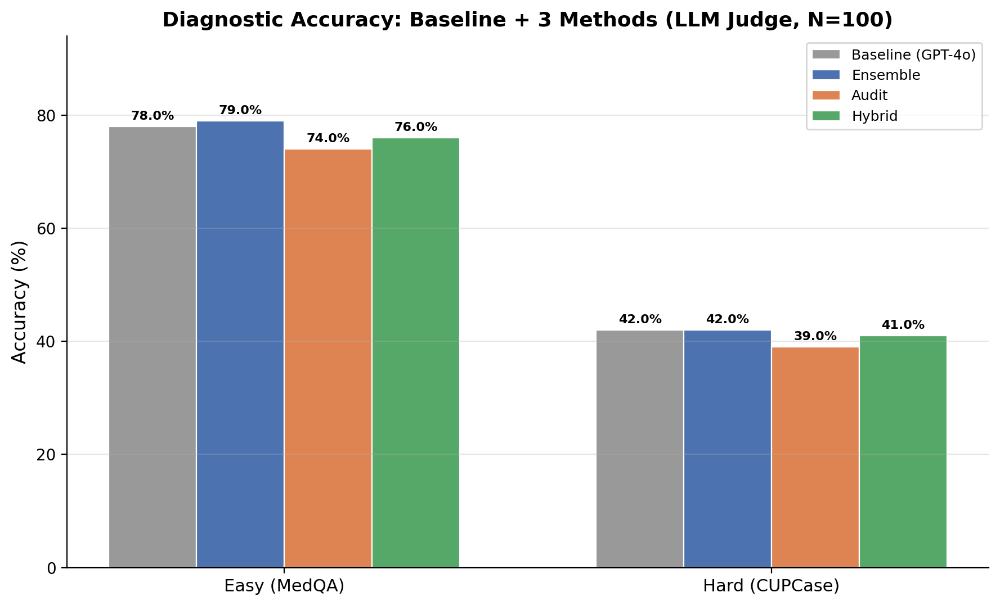

# CUPCase Diagnostic Pipeline

This repository evaluates LLM-based diagnostic methods on two clinical datasets:

- **Easy (MedQA):** Standard medical Q&A cases (`datasets/easy_medqa.csv`, 4,177 cases)
- **Hard (CUPCase):** Real-world uncommon patient cases (`datasets/Case_report_w_images_dis_VF.csv`, 110K+ rows)

## Methods

### Baseline: GPT-4o Standalone
Single-model zero-shot diagnosis using GPT-4o (extracted from Stage 1 output).

### Stage 1: Knowledge Ensemble (`ensemble_v2.py`)
Aggregates independent candidate diagnoses from **GPT-4o** and **DeepSeek-V3**, then checks semantic agreement.

### Stage 2: Systematic Reasoning Audit (`audit_pipeline.py`)
Forces a structured "For vs. Against" evidence check for each candidate using **GPT-4o**, producing a final diagnosis with confidence score. The model is constrained to select from the given candidates only.

### Stage 3: Hybrid Pipeline (`hybrid_boss_turbo.py`)
Combines Stage 1 (ensemble) and Stage 2 (audit) sequentially: candidates from the ensemble are passed through the audit filter.

## Evaluation

Uses a unified LLM judge (`judge/unified_judge.py`) with strict clinical equivalence rules, retry logic, and caching. The judge uses DeepSeek to assess clinical equivalence (e.g., recognizing abbreviations, synonyms, and added clinical detail as correct). No fuzzy fallback — all evaluations are LLM-based.

## Results (N=100, LLM Judge)

| Method | Easy (MedQA) | Hard (CUPCase) |
|--------|:------------:|:--------------:|
| Baseline (GPT-4o) | 78.0% | 42.0% |
| **Ensemble** | **79.0%** | **42.0%** |
| Audit | 74.0% | 39.0% |
| Hybrid | 76.0% | 41.0% |



## Setup

1. Copy `.env.example` to `.env` and add your API keys:
   ```bash
   cp .env.example .env
   ```
2. Install dependencies:
   ```bash
   pip install openai pandas tqdm nest_asyncio python-dotenv requests
   ```

## Reproduce Results (N=100)

```bash
# --- Easy dataset ---
python ensemble_v2.py --data-path datasets/easy_medqa.csv --output-dir output-100-easy --samples 100 --seed 42
python audit_pipeline.py --ensemble-results output-100-easy/ensemble_v2_results_100.csv --output-dir output-100-easy
python hybrid_boss_turbo.py --data-path datasets/easy_medqa.csv --output-dir output-100-easy --samples 100 --seed 42

# --- Hard dataset ---
python ensemble_v2.py --data-path datasets/Case_report_w_images_dis_VF.csv --output-dir output-100-hard --samples 100 --seed 42
python audit_pipeline.py --ensemble-results output-100-hard/ensemble_v2_results_100.csv --output-dir output-100-hard
python hybrid_boss_turbo.py --data-path datasets/Case_report_w_images_dis_VF.csv --output-dir output-100-hard --samples 100 --seed 42

# --- Evaluate with LLM judge ---
python plot_results.py --easy-dir output-100-easy --hard-dir output-100-hard --output-dir output-100-results
```

## HuggingFace Local Models (Qwen3.5)

Run the full pipeline with local models on GPU (no API keys needed for inference):

```bash
# Install HF dependencies
pip install transformers torch accelerate huggingface_hub bitsandbytes

# Run with Qwen3.5-27B (main) + Qwen3.5-9B (ensemble + judge)
python hf_experiment.py \
    --model-main Qwen/Qwen3.5-27B \
    --model-small Qwen/Qwen3.5-9B \
    --samples 10 --seed 42 --output-dir output-hf

# Or submit to SLURM (MIT HPC)
sbatch run_hf_test.sh
```
